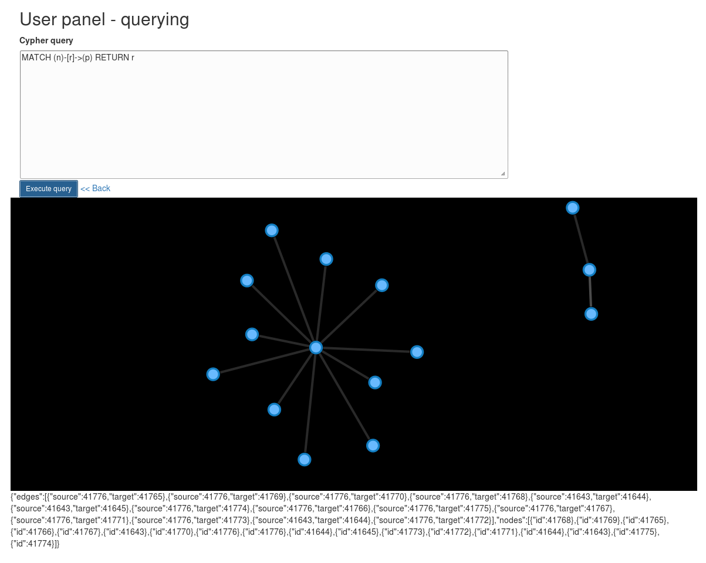

# neoPython

### Whats inside

* large app approach
* Flask (flask, flask-cache)
* Neo4J (py2Neo)
* example controller, model, adapter
* example jinja2 templates + bootstrap


### Functions

#### User
* Make cypher queries
* Create node access groups / add other users to groups (API)
* Upload images and associate them with nodes
* Import / export graphs
* Log in, register, activation mail

#### Admin
* Admins and supervising super-Admin
* Block and delete users - also grant them admin rights

#### Visualization





### Local installation
```sh
git clone https://github.com/mobile2015/neoPyth.git
cd neoPyth
virtualenv -p /usr/bin/python2 env
. env/bin/activate
pip2 install -r app/requirements.txt
python2 run.py
```

### Deployment
#### without security stuff like creating separate users, chrooting etc.

```sh

wget -O - http://debian.neo4j.org/neotechnology.gpg.key| apt-key add -
echo 'deb http://debian.neo4j.org/repo stable/' > /etc/apt/sources.list.d/neo4j.list
apt-get update -y
apt-get install neo4j
nano /etc/neo4j/neo4j-wrapper.conf
add line:    wrapper.java.additional=-Xmx1G
/etc/init.d/neo4j-service start

cd /home/user
git clone https://github.com/mobile2015/neoPyth.git
cd neoPyth
virtualenv -p /usr/bin/python2 env
. env/bin/activate
pip2 install -r app/requirements.txt
deactivate

sudo su
apt-get install apache2 libapache2-mod-wsgi
a2enmod wsgi

nano /etc/apache2/sites-available/neopyth.conf

    <VirtualHost *:80>
            ServerName example.domain.com
            ServerAdmin user@example.domain.com
            WSGIScriptAlias / /home/user/neoPyth/deploy.wsgi
            WSGIDaemonProcess neopyth processes=2 threads=6 display-name=neopyth user=user group=users
            <Directory /home/user/neopyth/>
                WSGIProcessGroup neopyth
                Require all granted
            </Directory>
            Alias /static /home/user/neoPyth/static
            <Directory /home/user/neoPyth/static/>
                Require all granted
            </Directory>
    
    
            ErrorLog ${APACHE_LOG_DIR}/error.log
            LogLevel warn
            CustomLog ${APACHE_LOG_DIR}/access.log combined
    </VirtualHost>
    
a2ensite neopyth

btw. deploy WSGI is:

    #!/usr/bin/python2
    import sys
    import logging
    
    logging.basicConfig(stream=sys.stderr)
    
    activate_this = "/home/user/neoPyth/env/bin/activate_this.py"
    exec(open(activate_this).read(), dict(__file__=activate_this))
    
    sys.path.insert(0, "/home/user/neoPyth")
    from app import app as application

```

### Links

* http://flask.pocoo.org/
* http://py2neo.org/2.0/index.html
* https://github.com/mitsuhiko/flask/wiki/Large-app-how-to
* https://github.com/BorisMoore/jquery-tmpl

### Structure

```
├── app
│   ├── controllers
│   │   ├── example.py
│   │   ├── __init__.py
│   │   └── user.py
│   ├── __init__.py
│   ├── models
│   │   ├── adapters
│   │   │   ├── graph.py
│   │   │   ├── helpers
│   │   │   │   ├── edge.py
│   │   │   │   ├── __init__.py
│   │   │   │   └── node.py
│   │   │   └── __init__.py
│   │   ├── example.py
│   │   ├── groups.py
│   │   ├── images.py
│   │   ├── __init__.py
│   │   ├── user.py
│   │   ├── security.py
│   │   └── utils.py
│   ├── static
│   │   ├── css
│   │   │   ├── ...
│   │   ├── fonts
│   │   │   ├── ...
│   │   ├── images
│   │   │   └── favicon.ico
│   │   └── js
│   │       ├── ...
│   └── templates
│       ├── errors
│       │   ├── error_401.html
│       │   ├── error_403.html
│       │   ├── error_404.html
│       │   ├── error_410.html
│       │   └── error_500.html
│       ├── example
│       │   └── example.html
│       ├── index.html
│       ├── macros
│       │   └── import.html
│       ├── master_template.html
│       └── user
│           ├── activation.html
│           ├── admin_panel.html
│           ├── images.html
│           ├── loadgraph.html
│           ├── login.html
│           ├── panel.html
│           ├── register.html
│           └── savegraph.html
├── config.py
├── LICENSE
├── README.md
├── requirements.txt
├── run.py
├── save-load
│   ├── addSampleGraph.py
│   ├── parser.py
│   ├── removeGraph.py
│   └── saveGraphToFile.py
├── server.log
├── shell.py
├── test.dump
├── tests
│   ├── __init__.py
│   └── services
│       ├── __init__.py
│       └── security_test.py
└── uploads

```